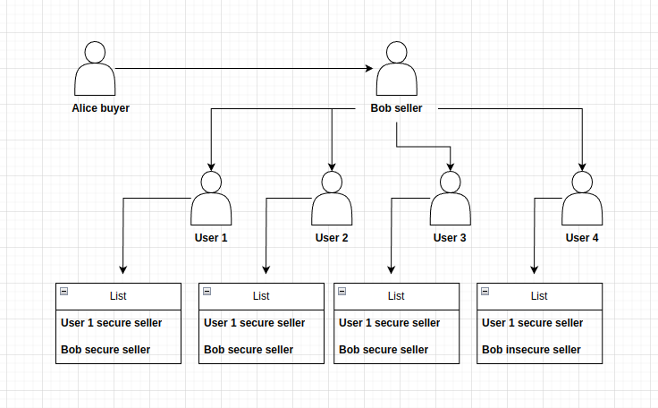

# Sistema de reputação 

### Descrição 

O processo de compra e venda de bitcoin no app não possui restrições, 
sistemas de retenção de saldos, ou qualquer tipo de sistema que garante que você receberá 
os satoshis que comprou em uma ordem de venda, ao invéz de implementar
um sistema de retenção de saldos, foi esolhido o sistema natural do capitalismo: 'Reputação'.

`Reputação é basicamente as pessoas conhecerem oque você já fez em sua história`

Então, foi pensado um sistema em que, quando um usuário compra bitcoin em uma ordem sua,
todos os usuários na rede conectados aos mesmos relays ou a pelo menos um dos relays, poderá
ver se o comprador recebeu ou não. De modo que se houver algum problema, ou você não enviar 
os sats que vendeu, todos poderão ver e não comprar mais de você, definindo os incentívos 
para crescer como vendedor P2P seja somente através de uma boa reputação.



O diagrama acima descreve o processo em que Alice, antes de realizar uma compra de uma ordem 
do Bob, consulta a sua reputação com seus compradores passados (user 1, user 2, user 3 e user 4).
Note que 3 deles consideram Bob um verndedor seguro, e um considera Bob um verndedor inseguro,
por tanto, pode-se calcular um ponto percentual da reputação de Bob:

```math
    R = (100 / F) * S 
```

A formula simples acima calcula o percentual de compradores que consideram Bob inseguro
do total de compradores, onde **F** é a quantidade total de pessoas que já compraram de Bob, 
**S** é a quantidade decompradores que consideram Bob inseguro e **R** é o percentual de 
compradores que consideram Bob seguro dentre todas as pessoas que já compraram dele.

Executando a fórmula acima utilizando os dados de Bob, onde **F**=4 e **S**=3 temos como 
resultado a taxa de reputação de 75, então **Alice** poderá escolher comprar ou não de **Bob**
considerando sua taxa de comfiabilidade de 75%. Note que **User 1** possui **F**=4 e **S**=4,
então a sua taxa de confiabilidade é 100%, ou seja, todos os compradores o consideram seguro,
então **Alice** poderá escolher comprar de **User 1**.

**O sistema de reputação pode ser aplicado também para compradores, para assim oferecer segurança
para ambas as partes.**

#### Utilizando a TimeChain para validar reputação

Para garantir que não haja má conduta de nenhuma das partes, a informação que indica se o vendedor 
é seguro ou não, não é adicionada pelo próprio usuário, ela é adicionada automaticamente quando
o comprador receber o saldo em sua carteira. Para isso, é utilizado o último bloco minerado.
Quando o comprador realiza o pagamento, o sistema salva o último bloco minerado e aguarda 
a mineração do pŕoximo bloco, quando o próximo bloco é minerado, então o sistema verifica se
nele existe uma transação que envia o saldo da **ordem de venda** para o comprador, caso
exista a transação, ou seja, o comprador recebeu o saldo, então é adicionado a lista de reputação
do usuário comprador, a informação de que o vendedor é seguro.

Para o vendedor, o mesmo será feito utilizando o seu processador de pagamento, assim que recebido
o saldo da **ordem de venda**, o sistema automaticamente adiciona a lista de reputação do 
usuário vendedor, a informação de que o comprador é seguro.

Além da verificação de que o vendedor é seguro ou não, o usuário poderá adicionar uma avaliação, 
o mesmo ocorre para o comprador.

### Implementação

Para implementar tal sistema são utilizados eventos de [listas públicas NIP 51](https://github.com/nostr-protocol/nips/blob/master/51.md).
Todos os usuários que realizam compras adicionam os detalhes a um evento de lista, no evento
deve ser adicionada a tag **r**: "reputation", para indicar que a lista contem dados de reputação.

Além da tag **r**, deve ser adicionada a tag **reputation** que deve conter uma lista de objetos
serializados dos dados de reputação por exemplo:

```json
    {
        ...,
        tags: [
            ["r", "reputation"],
            ["reputation", "[{ \"pubkey\": \"fdf46f77...\"... }","{...}]"]
        ]
    }    
```

Os dados de reputação devem conter o seguinte formato:

```json
    {
        "pubkey": "fdf46f77..",
        "safe_seller": true,
        "about": "Excellent service..."
    } 
```

A lista deve também conter a tag **p**: ["fdf46f77...", ..], que deve conter as chaves públicas 
dos usuários citados, de modo que, para verificar a reputação de um vendedor específico
possam ser listados os eventos de reputação que o mencionam.

**Exemplo**:  

```json
    {
      "kind": 10003,
      "created_at": 1675642635,
      "content": "arbitrary data",
      "tags": [
            ["r", "reputation"],
            ["reputation", "[{ \"pubkey\": \"fdf46f77...\"... }","{...}]"]
            ["p", "fdf46f77..."],
            ["e","b3e392b11f...", "wss://relay.example.com"],
      ],
      "pubkey": "...",
      "id": "..."
    }
```


